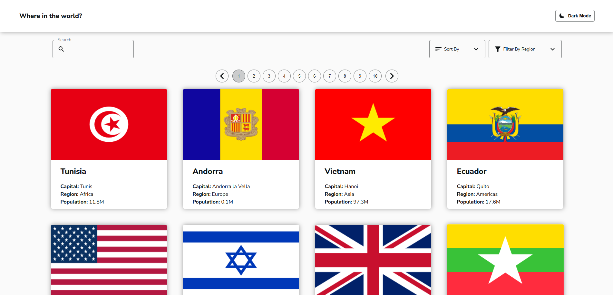
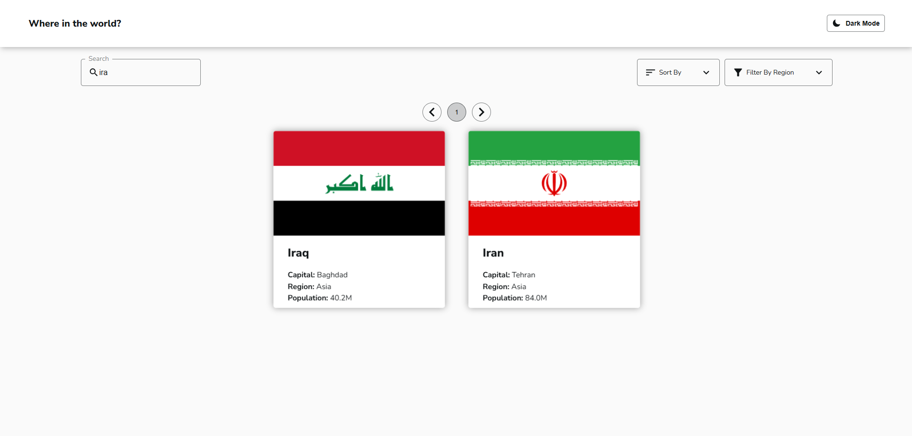
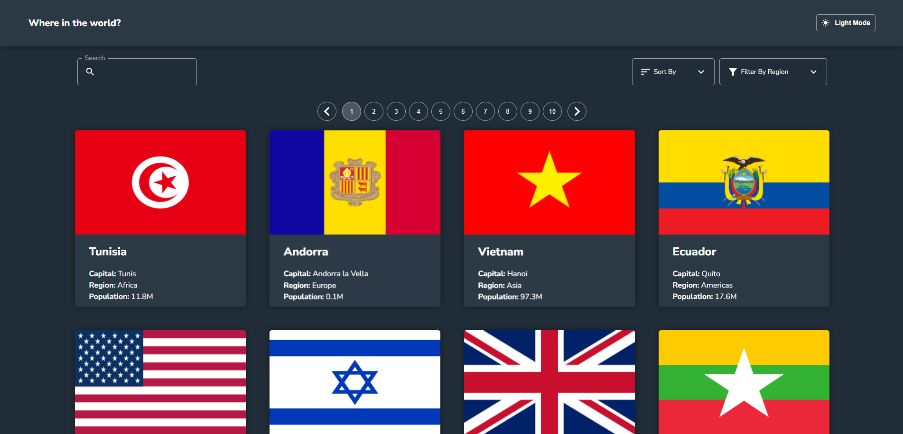

# 🌍 Rest Countries API App

Rest Countries API App is a responsive web application built with **vanilla JavaScript (ES6 modules)** that allows users to browse and explore country information. The application provides **real-time search**, **filtering by continent**, **sorting options**, and supports both **dark** and **light themes** that persist across sessions.

## 🔗 Live Preview

[**View Rest Countries API App Live**](https://fanciful-toffee-bcce4b.netlify.app/)

## 🛠️ Setup Instructions

Follow these steps to run the project locally:

### 1. 📁 Clone the Repository

```bash
git clone https://github.com/adel-nodehi/rest-countries-api.git
cd rest-countries-api
```

### 2. 📦 Install Dependencies

```bash
npm install
```

### 3. ▶️ Run the App

```bash
live-server
```

## 🚀 Features

- 🔎 **Instant Search**: Search countries by name with real-time results.
- 🌍 **Filter by Continent**: Narrow down countries by their region.
- ↕️ **Sorting Options**: Sort countries for easier navigation.
- 🌗 **Dark & Light Mode**: Toggle between themes. The app remembers your last choice using local storage.
- 📱 **Responsive Design**: Optimized for both desktop and mobile devices.

## 🧰 Technologies Used

- **HTML5**
- **CSS3 (Responsive Design)**
- **JavaScript (ES6 Modules)**
- **Local Storage** (for theme persistence)

## 🖼️ Screenshots

- Home page  
  

- Search functionality  
  

- Dark mode  
  
